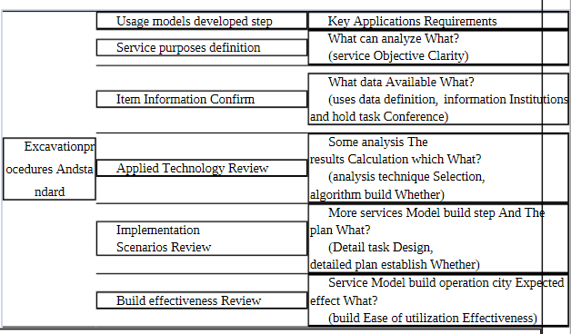

# Abstract

Companies and government agencies have recently begun to develop big data systems for large-scale data processing. Companies are using data analysis to provide a variety of services to their customers after implementing big data platforms. For the open data site, the public sector supplies the information you have in each institution. In addition, by evaluating the data provided through the public data portal, the public is creating a variety of services. However, it has yet to be established how to design a process, including data collecting and service models through data analysis, as well as how to employ normal software development methodologies to set up development projects. After the findings of the data collecting and analysis services plan have been decided, a big data service model is built. This paper outlines a strategy for constructing Big Data service model.

# Introduction

Furthermore, while the present ISO standard methodology provides a program, a database, a user interface, operation systems, and implementations, it is impossible to apply the major drawback of building service data models. Domestic firms employ CBD and information engineering techniques in developing methodologies, whereas public institutions use CBD and information engineering methodologies. It is tough to move in the development process for this development approach, the software development project, which outputs the analysis, design, development, and implementation in a single easy-to-apply massive building data model.

The goal of a big data service model is to create a model that generates information about decision data for analysis. This circumstance is an approach for creating a large data model that accurately reflects the situation. If the big data model created during the requirement analysis phase is unclear, it will be based on the results of employing diverse data. Furthermore, if further data analysis is gained in addition to data obtained from the corporation or the outcome is a public institution, data analysis and other results are obtained.

Companies and public organizations have been using the Big Data System project to evaluate a large amount of data for the past 2-3 years. Following the conclusion of data analysis, the Big Data System project maintains each company and public institution's data, as well as other data related to the institutions and big data analysis. If a big data model does not produce the necessary degree of results from analysis, it is designed to accommodate variances in software development processes, which result in innumerable design and development iterations. As a result, based on the growth of big data utilization, the creation of techniques that can serve as a guide to project implementation is required. A procedure for designing, implementing, and validating a big data model exists. a paradigm for using big data to get the answers you want from massive volumes of data as a result, I advocate Agile methodology in the case of big data system development and business model analysis.

# Related Work

Playing out a Big Data Model procedure incorporates a wide scope of improvement. After distinguishing the qualities and issues of different help model to foster techniques for building models’ enormous information to be gotten to in a way to further develop them. Begin with, assemble enormous information model has no requirements, in contrast to a normal programming advancement. For instance, if your elements demand introduced clear data necessities for abilities advancement, however much of the time there is no prerequisite for a structure enormous information model. While playing out the venture necessities of clients is muddled a specific deferral happens to the examination and plan phase. This section presents a utilization models created strategies for building large information model. It additionally characterizes the methodology and rules used model created presents the measures and strategies to reveal the enormous information administration model.

# Big data leverage model development Methods

Big data focuses on the accuracy of the forward or determination result usage analysis rather than the data processing speed required to derive the desired result. Countless iterations of design and development, as well as general development projects, differ about big data. The process of designing, implementing, and validating an analysis model to obtain the desired conclusion from a large amount of data is known as big data analysis.

We give criteria for developing big data models in this study. Analyse the substance of each item to present it in a complete customer requirements document.

# There are several techniques to overcome this situation. They are:

# Data Mining

A common tool used within big data analytics, data mining extracts patterns from large data sets by combining methods from statistics and machine learning, within database management. An example would be when customer data is mined to determine which segments are most likely to react to an offer.

# Machine Learning

Well known within the field of artificial intelligence, machine learning is also used for data analysis. Emerging from computer science, it works with computer algorithms to produce assumptions based on data.14 It provides predictions that would be impossible for human analysts.

# Natural Language Processing(NLP)

Known as a subspecialty of computer science, artificial intelligence, and linguistics, this data analysis tool uses algorithms to analyse human (natural) language.

# Statstics

This technique works to collect, organise, and interpret data, within surveys and experiments.

# Discussions and Conclusions

Big Data, low-cost commodity technology, and added information management and analytic tools have combined to create a watershed moment in data analysis history. Because of the convergence of these tendencies, we now have the capabilities to analyse massive data sets fast and cheaply for the first time in history. These abilities are neither hypothetical nor straightforward. They are a significant step forward and a clear chance to achieve massive benefits in efficiency, productivity, revenue, and profitability.

This document does not provide a presentation and assessment strategy for the basic techniques for constructing big data models, therefore the only thing it took to clean the room was some time. In this research will be offered through the creation of deliverables and methods required for the construction of a big data model. 
